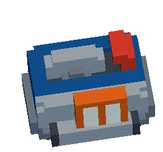
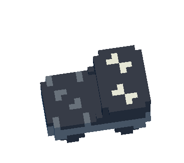
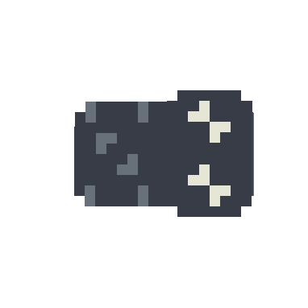
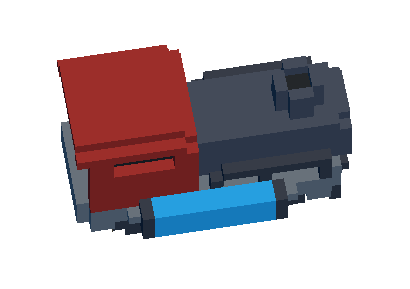
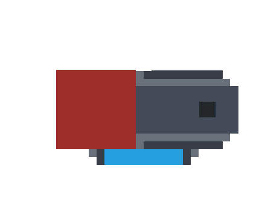

# u2-wagon

  

## u2-wagonについて
ある程度統一された形式でUnrailed 2のワゴン画像を収集するプロジェクトです。[Releases](https://github.com/yuitaa/u2-wagon/releases)から`u2-wagon-x.x.zip`をダウンロードして使用してください。

### 含まれるファイル
ワゴン・エンジンそれぞれで横向き・上向きの画像が用意されています。

    
画像サンプル

    <table>
        <thead>
            <tr>
                <th>形式</th>
                <th>サンプル</th>
            </tr>
        </thead>
        <tbody>
            <tr>
                <td>ワゴン横</td>
                <td></td>
            </tr>
            <tr>
                <td>ワゴン上</td>
                <td></td>
            </tr>
            <tr>
                <td>エンジン横</td>
                <td></td>
            </tr>
            <tr>
                <td>エンジン上</td>
                <td></td>
            </tr>
        </tbody>
    </table>

### ファイル名
画像にはそれぞれワゴン/エンジン名・レベルに基づいた命名がされています。

|形式|ディレクトリ|ファイル名|
|---|---|---|
|ワゴン横|`sideview/{レベル}/`|`{ワゴン名}_s{レベル}.png`|
|ワゴン上|`topview/{レベル}/`|`{ワゴン名}_t{レベル}.png`|
|エンジン横|`sideview/engine/`|`{エンジン名}_s.png`|
|エンジン上|`topview/engine/`|`{エンジン名}_t.png`|

### 画像の大きさ
同じ形式の画像はサイズが共通しています。

|形式|画像の幅(px)|画像の高さ(px)|
|---|---|---|
|ワゴン横|269|252|
|ワゴン上|276|171|
|エンジン横|295|213|
|エンジン上|303|158|

同じ形式では画像内でのワゴン/エンジンの位置が同じです。つまり、ページトップのアニメーションのように同じ位置に画像を置いた時、ズレずに画像の切り替えができます。